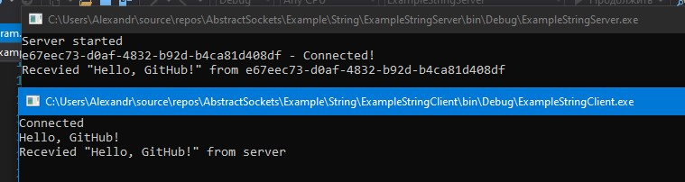

# AbstractSockets

## Fast deployment String server & String client:

Create StringStream:
```C#
public class StringStream : AbstractStream<string>
{
    public StringStream(NetworkStream ns, EndPoint ep, bool isServerStream) : base(ns, ep, isServerStream)
    {

    }

    public override async Task<bool> SendAsync(string data)
    {
        return await SendRawAsync(Encoding.UTF8.GetBytes(data));
    }

    protected override void ReceivedRaw(byte[] data)
    {
        RaiseOnReceived(Encoding.UTF8.GetString(data));
    }
}
```

Create StringServer:
```C#
class StringServer : AbstractServer<string>
{
    protected override IAbstractStream<string> CreateStream(NetworkStream ns, EndPoint ep)
    {
        return new StringStream(ns, ep, true);
    }
}
```

Create StringClient:
```C#
class StringClient : AbstractClient<string>
{
    protected override IAbstractStream<string> CreateStream(NetworkStream ns, EndPoint ep)
    {
        return new StringStream(ns, ep, false);
    }
}
```

Start StringServer:
```C#
static void Main(string[] args)
{
    var server = new StringServer();

    server.OnDataReceived += Server_OnDataReceived;
    server.OnClientConnected += Server_OnClientConnected;
    server.OnClientDisconnected += Server_OnClientDisconnected;

    server.Start(IPAddress.Any, 29000);

    Console.ReadLine();
}

private static void Server_OnClientDisconnected(IAbstractServer<string> abstractServer, Guid guid, NetStoppedReason reason)
{
    Console.WriteLine($"{guid} - Disconnected!");
}

private static void Server_OnClientConnected(IAbstractServer<string> abstractServer, Guid guid)
{
    Console.WriteLine($"{guid} - Connected!");
}

private static async void Server_OnDataReceived(IAbstractServer<string> abstractServer, Guid guid, string data)
{
    Console.WriteLine($"Recevied \"{data}\" from {guid}");

    await abstractServer.Streams[guid].SendAsync(data);
}
```

Start StringClient:
```C#
static void Main(string[] args)
{
    var client = new StringClient();

    client.OnConnected += OnConnected;
    client.OnDisconnected += OnDisconnected;
    client.OnReceived += OnReceived;

    client.ConnectAsync("127.0.0.1", 29000).Wait();

    while (true)
    {
        client.SendAsync(Console.ReadLine()).Wait();
    }
}

private static void OnReceived(IAbstractClient<string> abstractClient, string data)
{
    Console.WriteLine($"Recevied \"{data}\" from server");
}

private static void OnDisconnected(IAbstractClient<string> abstractClient, NetStoppedReason reason)
{
    Console.WriteLine("Disconnected");
}

private static void OnConnected(IAbstractClient<string> abstractClient)
{
    Console.WriteLine("Connected");
}
```

Result:  

